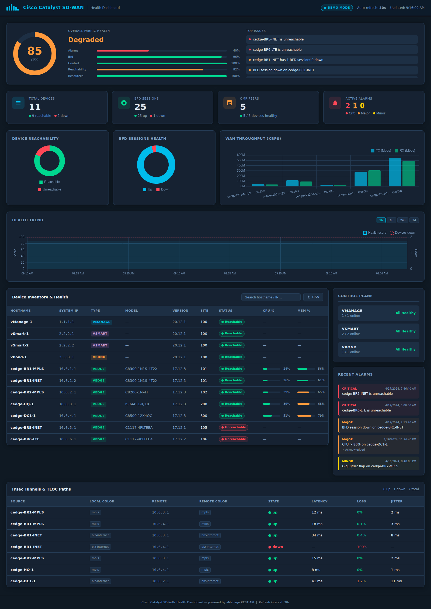
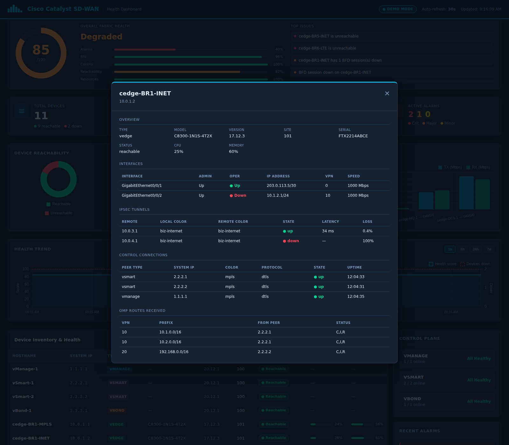

# Cisco Catalyst SD-WAN — Health Check Dashboard

A single-page operations dashboard that answers one question at a glance: **is the SD-WAN fabric healthy right now?**

A background poller pulls live state from the vManage REST API — device reachability, BFD and OMP sessions, IPsec tunnels, control-plane status, WAN throughput and alarms — scores it, stores it, and can notify you when it degrades.



---

## Quick start

The dashboard ships with realistic demo data, so it runs with no controller attached:

```bash
cd sdwan_dashboard
pip install -r requirements.txt
python app.py
```

Open <http://localhost:5000>.

### Connecting to a real vManage

```bash
cp .env.example .env
# edit .env: set SDWAN_MODE=live plus VMANAGE_HOST / USER / PASS
python app.py
```

### Docker

```bash
docker compose up --build          # demo mode
SDWAN_MODE=live VMANAGE_HOST=… docker compose up --build   # live
```

---

## What it shows

**Overall Fabric Health** — a single 0–100 score with the weighted breakdown behind it and the top issues driving it down. Graded `healthy` (≥90), `degraded` (≥70) or `critical`.

| Category | Weight | What it measures |
|---|---|---|
| Reachability | 40 | Devices vManage can reach |
| BFD | 25 | Data-plane tunnel sessions up vs. down |
| Control | 15 | vSmart / vBond / vManage controllers online |
| Alarms | 12 | Unacknowledged alarms, weighted by severity |
| Resources | 8 | Devices running hot on CPU or memory |

**Health Trend** — the score and the device-down count over the last hour, 6 hours, 24 hours or 7 days, so you can tell whether a problem is new, recurring or getting worse.

**IPsec Tunnels & TLOC Paths** — every tunnel with its colors, state, latency, loss and jitter.

**Device drill-down** — click any row in the inventory for that device's interfaces, IPsec tunnels, control connections, OMP routes and its own alarms.



Alongside those: KPI cards, reachability and BFD doughnuts, a WAN throughput chart, a searchable device inventory with CPU/memory bars, control-plane status and a severity-coloured alarm feed.

---

## Alerting

Alerting is off until you both enable it and give it a webhook:

```bash
ALERTS_ENABLED=true
ALERT_WEBHOOK_URL=https://hooks.slack.com/services/…
ALERT_WEBHOOK_FORMAT=slack     # or teams, or generic
```

Rules are evaluated on every poll, and fire when the health score drops below `ALERT_SCORE_THRESHOLD`, a device becomes unreachable, a device has BFD sessions down, or unacknowledged critical alarms reach `ALERT_CRITICAL_ALARM_COUNT`.

Each alert carries a stable key, so an ongoing problem is announced **once** and not repeated until `ALERT_COOLDOWN_SECONDS` has elapsed — a device down for an hour produces one message, not 120. When the condition clears, a recovery notice is sent and the state is dropped.

`generic` posts plain JSON (`{status, severity, message, timestamp}`), which suits PagerDuty Events, Opsgenie or your own receiver.

---

## Authentication

The dashboard serves the full network inventory — hostnames, system IPs, models, firmware versions, sites — and the process holds vManage credentials. Setting a password puts a login in front of all of it:

```bash
DASHBOARD_USER=admin
DASHBOARD_PASSWORD=…
SECRET_KEY=…            # keeps sessions valid across restarts
SESSION_COOKIE_SECURE=true   # once served over HTTPS
```

Leaving `DASHBOARD_PASSWORD` empty runs the dashboard open, which is fine for a local demo. In live mode that is logged as a warning at startup. `/healthz` always stays open so container probes keep working.

---

## API

Every endpoint returns JSON and is safe to scrape from another tool.

| Endpoint | Returns |
|---|---|
| `GET /api/health` | Overall score, per-category breakdown, findings |
| `GET /api/summary` | KPI counters |
| `GET /api/devices` | Normalized device inventory |
| `GET /api/device/<system_ip>` | Interfaces, tunnels, control connections, OMP routes, history |
| `GET /api/tunnels` | IPsec / TLOC tunnel state |
| `GET /api/history?hours=24` | Health score time series |
| `GET /api/alarms` | Alarms in the configured window |
| `GET /api/bfd` · `/api/omp` · `/api/interfaces` · `/api/control` | Per-panel data |
| `GET /api/status` | Poller freshness: age, staleness, last error |
| `GET /api/export/devices.csv` | Inventory as a CSV download |
| `GET /healthz` | Liveness probe |
| `GET /metrics` | Prometheus exposition (off by default) |

Panel responses carry `X-Data-Age` and `X-Data-Stale` headers. Before the first poll completes, endpoints return `503`; a vManage failure during drill-down returns `502` with a readable reason:

```json
{"error": "connection", "message": "Cannot reach vManage at https://10.0.0.1:8443 — the controller did not respond in time"}
```

---

## Configuration

All settings are environment variables; see `.env.example` for the full list.

| Variable | Default | Notes |
|---|---|---|
| `SDWAN_MODE` | `mock` | `live` talks to vManage |
| `VMANAGE_HOST` / `_PORT` | — / `8443` | Controller address |
| `VMANAGE_USER` / `_PASS` | — | Credentials |
| `VMANAGE_VERIFY_SSL` | `true` | `true`, `false`, or a path to the CA bundle for vManage's certificate |
| `VMANAGE_TIMEOUT` | `20` | Per-request timeout, seconds |
| `SESSION_TTL_SECONDS` | `900` | How long a vManage login is reused |
| `POLL_INTERVAL_SECONDS` | `30` | How often the fabric is collected |
| `REFRESH_INTERVAL_SECONDS` | `30` | Browser auto-refresh cadence |
| `DB_PATH` | `sdwan_history.db` | History database |
| `HISTORY_RETENTION_DAYS` | `7` | Samples older than this are pruned hourly |
| `CPU_WARN` / `CPU_CRIT` | `65` / `85` | Resource thresholds |
| `MEM_WARN` / `MEM_CRIT` | `65` / `85` | Resource thresholds |
| `ALARM_WINDOW_HOURS` | `24` | Alarm lookback window |
| `ALERTS_ENABLED` | `false` | Needs a webhook URL as well |
| `ALERT_COOLDOWN_SECONDS` | `3600` | Before re-announcing an ongoing problem |
| `DASHBOARD_PASSWORD` | — | Empty means no login |
| `METRICS_ENABLED` | `false` | Serve `/metrics` for Prometheus |
| `METRICS_TOKEN` | — | Bearer token required to scrape, when set |
| `CSP_ENABLED` | `true` | Content Security Policy header |

---

## Design notes

**Viewers do not drive load.** Browsers used to query vManage directly, so ten NOC screens meant ten times the load. Now one background poller collects the fabric on a fixed cadence and writes it to SQLite; every web worker serves from there. Load on the controller is the same whether nobody or fifty people are watching.

**Exactly one poller.** Under gunicorn every worker imports the app, so an advisory `flock` settles which one polls. The others read the store. Losing the race is normal, not an error.

**A failed poll never discards good data.** The last successful payload stays served and is marked stale, with the reason shown in a banner — operators keep seeing the last known state instead of an empty page, and know not to trust it as current.

**Sessions are reused.** vManage authentication costs a round trip and the controller throttles logins, so one session is cached until `SESSION_TTL_SECONDS` elapses. A `401`, or the HTML login page vManage returns for an idled-out session, invalidates it and the next call re-authenticates.

**Alerts are deduplicated, not just triggered.** Detecting a problem is easy; not shouting about it every 30 seconds is the part that decides whether anyone keeps the integration switched on.

**No CDN.** Chart.js is vendored under `static/vendor/`. SD-WAN management networks are routinely air-gapped, and a dashboard that renders blank without internet egress is useless in exactly the environment it is built for.

**One failing panel does not blank the page.** The browser refreshes panels with `Promise.allSettled`, so a single failing endpoint leaves the rest on screen.

**It feeds the monitoring you already have.** `/metrics` exposes the fabric score, per-device CPU and memory, link utilisation, QoS drops and SLA compliance in Prometheus format, so the fabric shows up in the Grafana a NOC already watches instead of being one more screen. `sdwan_up` and `sdwan_poll_age_seconds` are reported separately from fabric health, so a stopped collector can be alerted on distinctly from a degraded network.

**Errors stay readable.** Transport exceptions are translated before they reach the operator — "the host is unreachable or refused the connection", not a urllib3 object address.

**Escaping is decided by provenance, never by how a value looks.** Only `stateSpan()` can mint a `SafeMarkup`, so no value arriving from vManage can pass itself off as the dashboard's own markup. Config that controls a security boundary fails closed too: an unrecognised `VMANAGE_VERIFY_SSL` is treated as a CA-bundle path and errors, rather than being coerced to "off".

---

## Tests

```bash
pip install -r requirements-dev.txt
python -m pytest tests/ -q
```

90 tests covering the API contract, scoring rules and their edge cases (empty fabric, offline devices reporting no telemetry), store retention and windowing, poller failure handling, alert deduplication and recovery, and the login — including that `?next=` cannot be used as an open redirect.

---

## Layout

```
sdwan_dashboard/
├── app.py               Flask app, routes, vManage session cache
├── poller.py            Background collection loop and cross-process lock
├── store.py             SQLite: latest payload, history, alert state
├── alerts.py            Rules, deduplication, webhook delivery
├── auth.py              Optional login
├── health.py            Scoring rules
├── sdwan_client.py      vManage REST client + mock data provider
├── config.py            Environment configuration
├── templates/           Dashboard and login pages
├── static/
│   ├── css/             Theme
│   ├── js/              Refresh loop, charts, drill-down modal
│   └── vendor/          Chart.js (vendored, no CDN)
└── tests/               pytest suite
```
